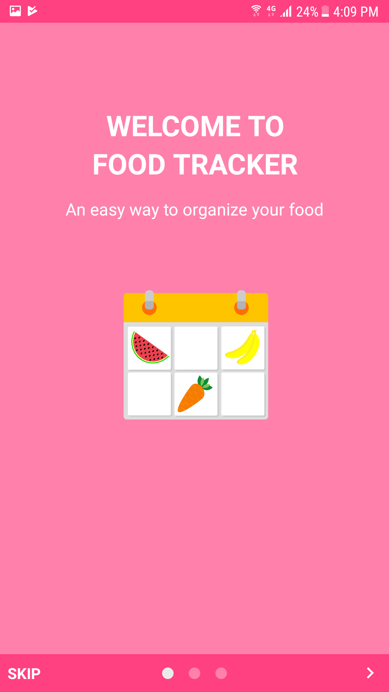
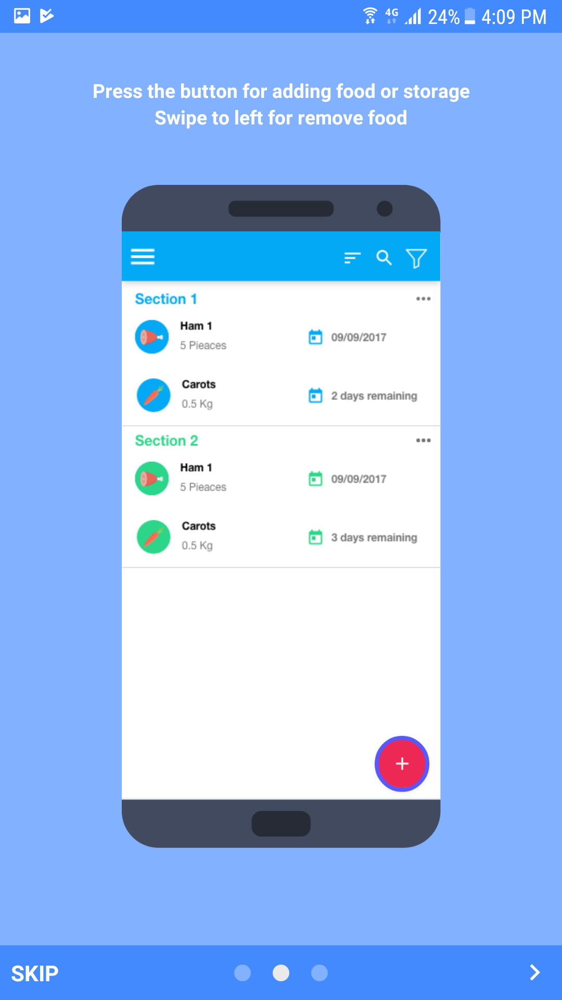
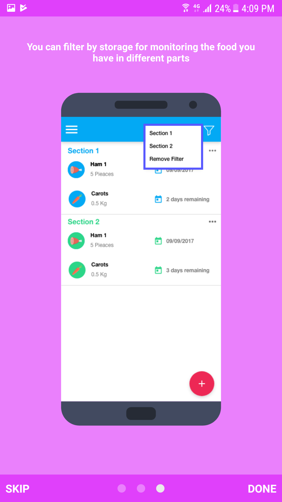
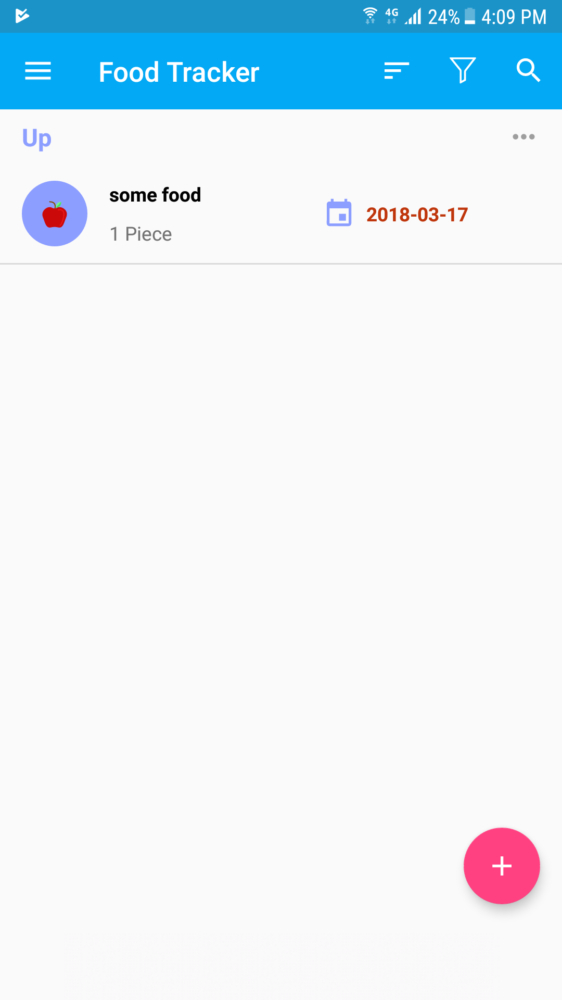
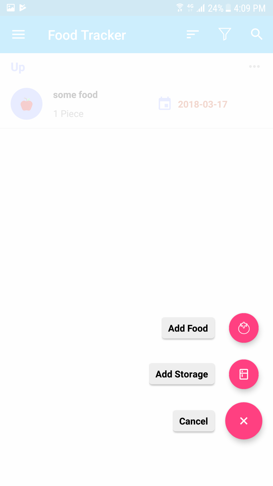
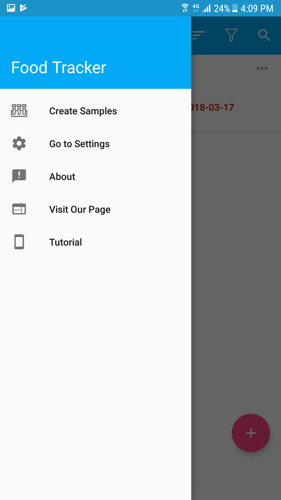
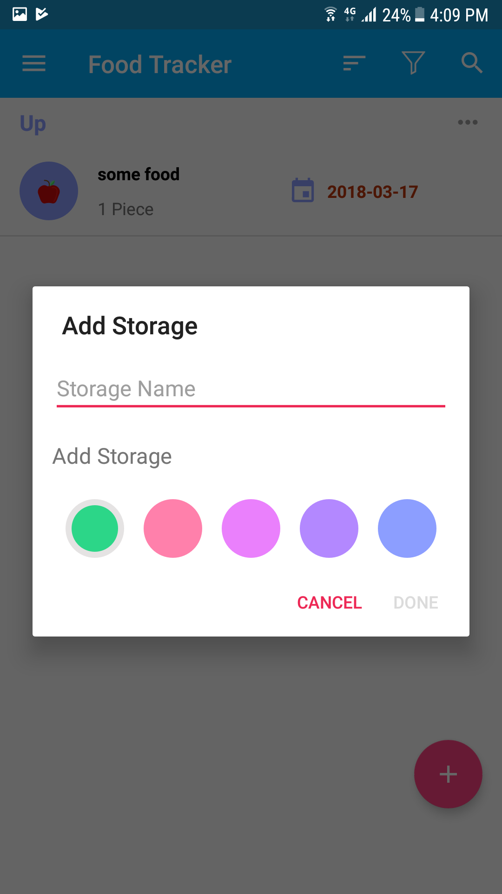
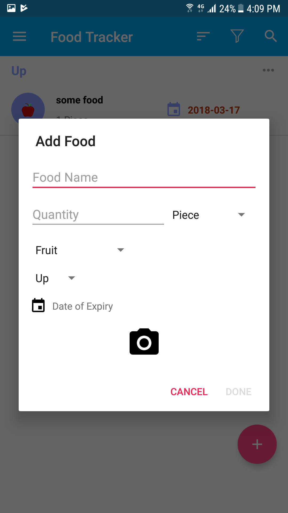

# Food Tracker

Description
---
With Food Tracker you can manage your food by storage. The app notifies you when the date of expiry of the food is approaching. 

Download
---

Overview
---
- A open source project
- Admob for showing ads
- Usage of content provider for persisting data
- Reminder widget
- ViewPager as welcome screens
- Job Scheduler for scheduling tasks
- Alarm manager for launching notifications
- Notification system to alert user the expiry

Screenshots
---

Authors
---
- Ken Ruiz Inoue

Credits
---
- Logo and icons designed by Yeco Technologies

License
-------
    MIT License

    Copyright (c) 2018-present Ken Ruiz Inoue

    Permission is hereby granted, free of charge, to any person obtaining a copy
    of this software and associated documentation files (the "Software"), to deal
    in the Software without restriction, including without limitation the rights
    to use, copy, modify, merge, publish, distribute, sublicense, and/or sell
    copies of the Software, and to permit persons to whom the Software is
    furnished to do so, subject to the following conditions:

    The above copyright notice and this permission notice shall be included in all
    copies or substantial portions of the Software.

    THE SOFTWARE IS PROVIDED "AS IS", WITHOUT WARRANTY OF ANY KIND, EXPRESS OR
    IMPLIED, INCLUDING BUT NOT LIMITED TO THE WARRANTIES OF MERCHANTABILITY,
    FITNESS FOR A PARTICULAR PURPOSE AND NONINFRINGEMENT. IN NO EVENT SHALL THE
    AUTHORS OR COPYRIGHT HOLDERS BE LIABLE FOR ANY CLAIM, DAMAGES OR OTHER
    LIABILITY, WHETHER IN AN ACTION OF CONTRACT, TORT OR OTHERWISE, ARISING FROM,
    OUT OF OR IN CONNECTION WITH THE SOFTWARE OR THE USE OR OTHER DEALINGS IN THE
    SOFTWARE.
